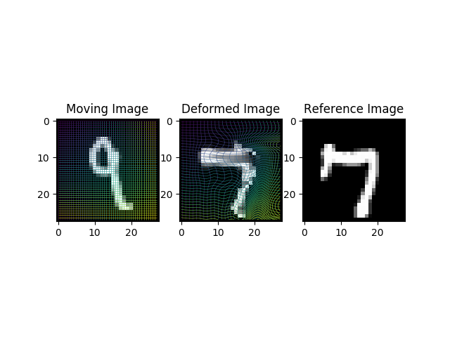

# Tensorflow Layer for Joint Linear and Deformable Registration 

This is a tensorflow - with `Keras` backend - implementation of the Transformer Layer with the smoothness constraint that was presented in 2D at:

> Shu, Z., Sahasrabudhe, M., Alp Guler, R., Samaras, D., Paragios, N. and Kokkinos, I., 2018. Deforming autoencoders: Unsupervised disentangling of shape and appearance. In Proceedings of the European Conference on Computer Vision (ECCV) (pp. 650-665).

and in 3D at:

> Stergios, C., Mihir, S., Maria, V., Guillaume, C., Marie-Pierre, R., Stavroula, M. and Nikos, P., 2018. Linear and deformable image registration with 3d convolutional neural networks. In Image Analysis for Moving Organ, Breast, and Thoracic Images (pp. 13-22). Springer, Cham.

Please cite the aforementioned publications if you use this code. In case of any questions, please do not hesitate to contact us.

## Environment:

This code was tested on a Linux machine with Ubuntu (16.04.4 LTS) using the following setup:

- CUDA (9.0)
- CUDNN (v7)
- python (3.5.2)
    * tensorflow (1.8.0)
    * keras (2.1.6)
    * matplotlib (2.2.2)

## How to use:

In order to excecute the example scripts you can run the following:
```
pip install -r requirements{-gpu}.txt
python example-2d.py
python example-3d.py
```

You can use the smoothTransformer Layer in a similar fashion as any other keras layer:

```python
from smoothTransformer import smoothTransformer2D, smoothTransformer3D

...
[deformed, sampling_grid] = smoothTransformer2D(maxgrad=4)([moving, deformable, affine])
or
[deformed, sampling_grid] = smoothTransformer3D(maxgrad=4)([moving, deformable, affine])
...
```

#### Arguments 
- **maxgrad:** The maximum deformation among consecutive pixels (Should be set to 2 or more).

The inputs and outputs of this layer are tensorflow tensors. Zero weight and bias initialization is sugested for the layers that regress the affine and deformable deformations. This would initiate the training progress from an identity transformation instead of a random one. A logistic growth function (f) is applied internally and maps the deformable gradients to positive values within the range [0, maxgrad] while 0 is mapped to 1. After this step the integration along the different axis is performed. Thus, the parameter `maxgrad` controls the maximum distance among consecutive pixels in the deformed image.

## Output

Example of the output of the `example-2d.py` script (result only after a single training epoch):




## Note

Note that the example 2D and 3D scripts implement different networks that the ones presented in the initial publications.